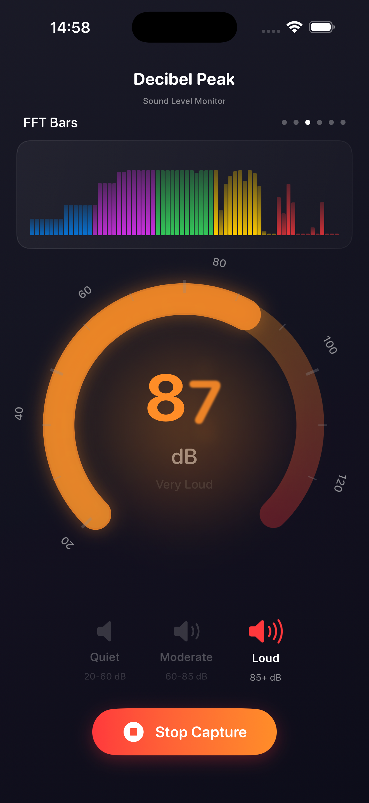
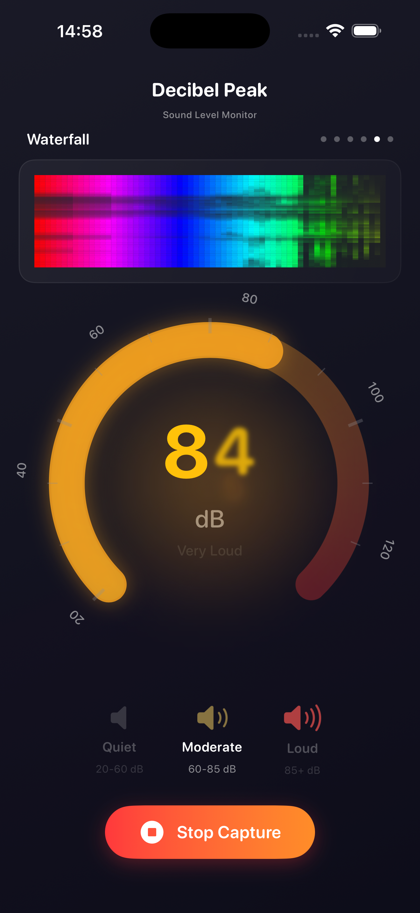
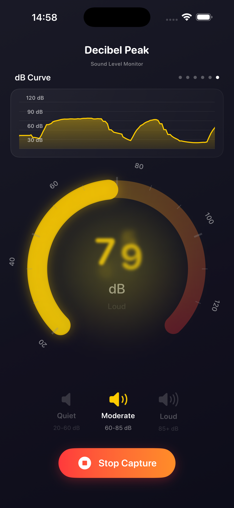
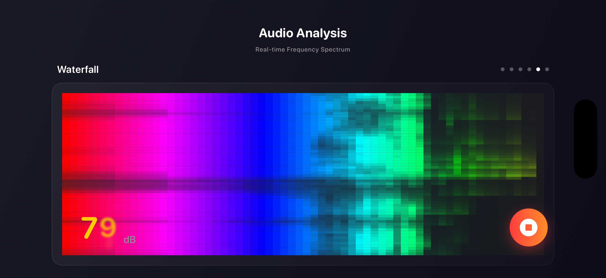

# DecibelPeak

<p align="center">
  
</p>

<p align="center">
  <strong>Professional sound level monitoring for iOS</strong>
</p>

<p align="center">
  Real-time decibel measurements • Frequency spectrum analysis • Multiple visualization modes
</p>

---

## 📱 About

**DecibelPeak** is a sophisticated iOS application for monitoring and analyzing sound levels in real-time. Whether you're an audio professional, researcher, or just curious about your acoustic environment, DecibelPeak provides accurate decibel measurements with beautiful, intuitive visualizations.

## 🎥 Demo Video

<p align="center">
  <a href=".github/DecibelPeak-886-1920-60fps.mov">
    
  </a>
</p>

<p align="center">
  <strong>👆 Click image above to download and watch the demo video (28MB, 60fps)</strong><br/>
  <em>See DecibelPeak in action with real-time monitoring and multiple visualization modes</em>
</p>

## ✨ Features

### 🎯 Core Functionality
- **Real-time Decibel Monitoring**: Accurate sound level measurements from 20 to 130 dB
- **Color-Coded Levels**: Instant visual feedback with green (quiet), yellow (moderate), orange (loud), and red (dangerous) indicators
- **Auto-Start**: Automatically begins monitoring when microphone permissions are granted
- **Portrait & Landscape**: Optimized layouts for both orientations

### 📊 Six Visualization Modes

1. **Waveform** - Classic oscilloscope view of audio signal
2. **Spectrum** - Real-time amplitude spectrum display
3. **FFT Bars** - Frequency analysis with vertical bar chart (64 frequency bands, 20 Hz - 20 kHz)
4. **FFT Circle** - Circular frequency visualization
5. **Waterfall** - Spectrogram showing frequency changes over time
6. **dB Curve** - Historical decibel level tracking

<p align="center">
  <em>Auto-scrolls through visualizations every 3 seconds, or tap to manually cycle</em>
</p>

### 🎨 User Interface
- **Circular Gauge**: Beautiful analog-style meter with 270° arc
- **Sound Level Indicators**: Three-tier visual feedback system (Quiet/Moderate/Loud)
- **Contextual Labels**: Dynamic descriptions based on current sound level
- **Dark Theme**: Elegant gradient design optimized for any lighting condition
- **Responsive Design**: Perfectly adapted layouts for all iPhone models

## 🖼️ Screenshots

<p align="center">
  
  
  
  
</p>

<p align="center">
  
</p>

## 🔧 Technical Details

### Audio Processing
- **Sample Rate**: 44.1 kHz
- **Buffer Size**: 1024 samples
- **FFT Analysis**: Using Apple's Accelerate framework for optimized performance
- **Window Function**: Hanning window for frequency analysis
- **Update Rate**: 30 FPS for real-time responsiveness
- **RMS-based Calibration**: Accurate decibel calculations with smoothing

### Architecture
- **SwiftUI**: Modern declarative UI framework
- **AVFoundation**: Professional-grade audio capture
- **Accelerate**: Hardware-accelerated FFT computations
- **ObservableObject Pattern**: Reactive data flow
- **Timer-based Updates**: Separate timers for display and history tracking

### Code Highlights
```swift
// Real-time audio processing with FFT analysis
private func processAudioBuffer(_ buffer: AVAudioPCMBuffer) {
    // RMS calculation for decibel measurement
    let rms = sqrt(channelDataArray.map { $0 * $0 }.reduce(0, +) / Float(channelDataArray.count))
    let avgPower = 20 * log10(max(0.00001, rms))
    let calibratedDb = avgPower + 100

    // FFT analysis for frequency visualization
    let fftMagnitudes = fftAnalyzer.analyze(samples: channelDataArray)
    let bands = fftAnalyzer.getFrequencyBands(magnitudes: fftMagnitudes, bandCount: 64)
}
```

## 🚀 Getting Started

### Requirements
- iOS 17.0 or later
- Xcode 16.4 or later
- Swift 5.0 or later
- Microphone access permission

### Installation

1. Clone the repository:
```bash
git clone https://github.com/AndreFrelicot/DecibelPeak.git
cd DecibelPeak
```

2. Open the project in Xcode:
```bash
open DecibelPeak.xcodeproj
```

3. Select your development team in the project settings

4. Build and run on your device or simulator

### First Launch

On first launch, DecibelPeak will request microphone access. Grant permission to enable sound monitoring. The app will automatically start monitoring once permission is granted.

## 📖 Usage

1. **Start Monitoring**: Tap the microphone button or the app will auto-start with permissions
2. **View Measurements**: Watch the circular gauge for real-time decibel readings
3. **Explore Visualizations**: Tap the visualization area to cycle through different views
4. **Check Levels**: Observe the three-tier indicator (Quiet/Moderate/Loud) at the bottom
5. **Stop Monitoring**: Tap the stop button to pause measurements

### Sound Level Reference

| Range | Color | Description | Examples |
|-------|-------|-------------|----------|
| 20-60 dB | 🟢 Green | Quiet | Library, whisper, normal conversation |
| 60-85 dB | 🟡 Yellow | Moderate | Busy traffic, vacuum cleaner |
| 85-100 dB | 🟠 Orange | Loud | Lawn mower, motorcycle |
| 100+ dB | 🔴 Red | Dangerous | Concert, chainsaw, thunder |

> ⚠️ **Note**: Prolonged exposure to sounds above 85 dB can cause hearing damage.

## 🏗️ Project Structure

```
DecibelPeak/
├── DecibelPeak/
│   ├── DecibelPeakApp.swift          # App entry point
│   ├── ContentView.swift              # Main UI with responsive layouts
│   ├── AudioManager.swift             # Audio capture and processing
│   ├── FFTAnalyzer.swift              # Frequency analysis engine
│   ├── CircularGaugeView.swift        # Analog gauge component
│   ├── WaveformCarouselView.swift     # Visualization carousel
│   ├── WaveformView.swift             # Waveform display
│   ├── FFTVisualizationView.swift     # FFT visualization components
│   ├── Localizable.xcstrings          # Localized strings
│   └── Assets.xcassets/               # App icons and colors
├── DecibelPeakTests/                  # Unit tests
└── DecibelPeakUITests/                # UI tests
```

## 🌍 Localization

DecibelPeak supports multiple languages through `Localizable.xcstrings`. To add a new language:

1. Open `Localizable.xcstrings` in Xcode
2. Click the "+" button to add a language
3. Translate the strings for your locale

## 🤝 Contributing

Contributions are welcome! Here are some ways you can contribute:

- 🐛 Report bugs and issues
- 💡 Suggest new features or visualizations
- 🌍 Add translations for new languages
- 📝 Improve documentation
- 🔧 Submit pull requests

### Development Guidelines

1. Fork the repository
2. Create a feature branch (`git checkout -b feature/amazing-feature`)
3. Commit your changes (`git commit -m 'Add amazing feature'`)
4. Push to the branch (`git push origin feature/amazing-feature`)
5. Open a Pull Request

## 📄 License

This project is available for personal and educational use. For commercial use, please contact the author.

## 👤 Author

**André Frélicot**

- GitHub: [@AndreFrelicot](https://github.com/AndreFrelicot)
- Bundle ID: `dev.andrefrelicot.decibelpeak`

## 🙏 Acknowledgments

- Built with SwiftUI and AVFoundation
- FFT implementation using Apple's Accelerate framework
- Inspired by professional audio measurement tools

## 📞 Support

If you encounter any issues or have questions:

1. Check the [Issues](https://github.com/AndreFrelicot/DecibelPeak/issues) page
2. Create a new issue with a detailed description
3. Include your iOS version and device model

---

<p align="center">
  Made with ❤️ for the iOS audio community
</p>
