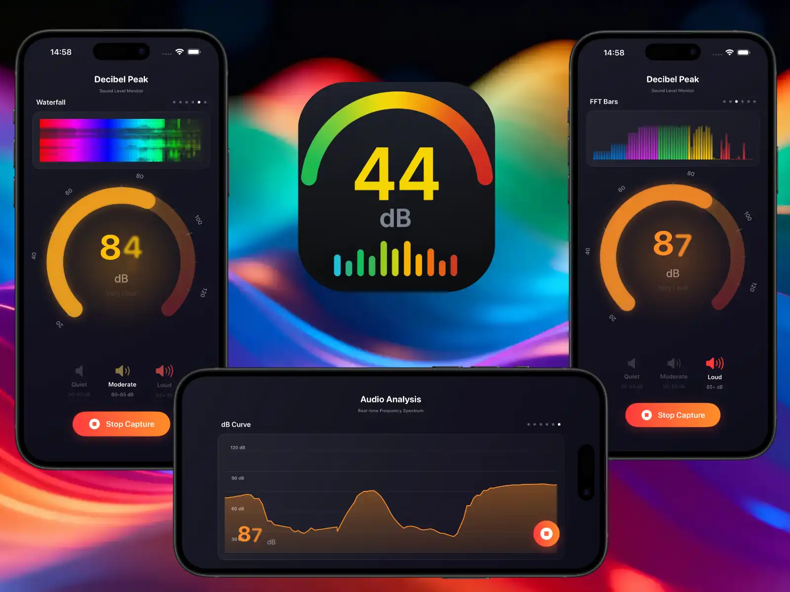
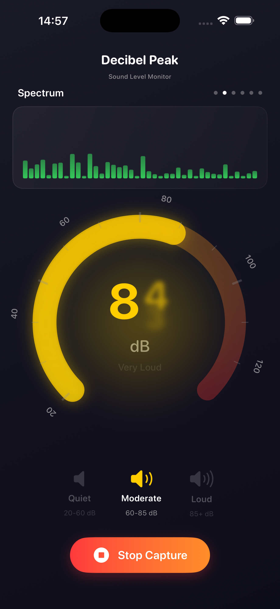
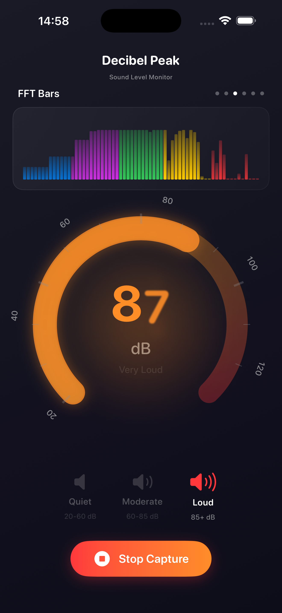
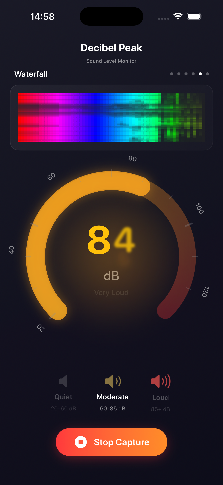
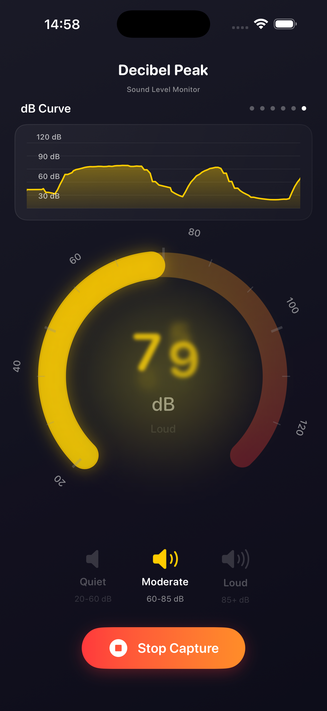
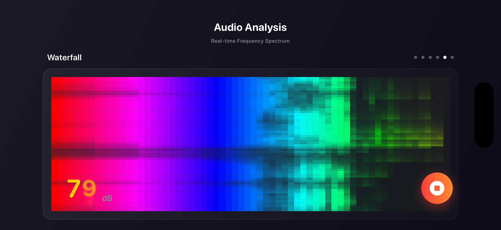

# DecibelPeak

<p align="center">
  
</p>

<p align="center">
  <strong>A fancy sound level monitor for iOS</strong>
</p>

<p align="center">
  Real-time decibel readings, frequency analysis, and several ways to look at the sound around you.
</p>

<p align="center">
  <a href="https://apps.apple.com/us/app/decibelpeak/id6752702602">
    
  </a>
</p>

---

## About

DecibelPeak measures sound levels with your iPhone's microphone and shows them in real time. It reads the current level on a circular gauge, tracks the loudest moment of the session, and offers several visualizations of the live audio. It's meant to be useful and good-looking rather than a calibrated measurement instrument.

## Demo video

<p align="center">
  <a href=".github/DecibelPeak-886-1920-60fps.mov">
    
  </a>
</p>

<p align="center">
  Click the image to download and watch the demo (~30 MB, 60 fps).
</p>

## Features

- **Real-time level monitoring** on a circular gauge spanning 20–130 dB over a 270° arc.
- **Color-coded levels**: blue (below 40 dB), green (40–60), yellow (60–80), orange (80–100), red (100 and above).
- **Calibration**: an adjustable offset of ±20 dB in 0.5 dB steps, with a snap-to-zero point. The setting is saved between launches.
- **Session peak tracking**: the app remembers the loudest moment of the session.
- **Session average**: an equivalent-level badge summarizing the session in a single number.
- **Auto-start**: monitoring begins on its own once microphone access is granted.
- **Portrait and landscape** layouts.
- **Six languages**: English, French, German, Spanish, Japanese, and Brazilian Portuguese.

### Visualizations

The visualization area holds seven views. It cycles through them on its own while monitoring, and you can swipe or tap to move through them yourself.

1. **Waveform** — oscilloscope-style view of the audio signal.
2. **Spectrum** — amplitude spectrum of the current sound.
3. **FFT Bars** — frequency content as vertical bars across the audible range.
4. **FFT Circle** — the same frequency content arranged in a circle.
5. **Waterfall** — a spectrogram showing how frequencies change over time.
6. **dB Curve** — recent decibel levels over time.
7. **dB Peak** — a 60-second window centered on the session's loudest moment, with a dashed marker at the exact second it happened. Scroll horizontally to move through the window.

## Screenshots

<p align="center">
  
  
  
  
</p>

<p align="center">
  
</p>

## Technical details

### Audio processing

- Sample rate: 44.1 kHz
- Buffer size: 1024 samples
- FFT via Apple's Accelerate framework (vDSP), with a Hann window
- Level computed from RMS, then converted to decibels with smoothing and an optional calibration offset
- Session average computed as an equivalent continuous level over the session

### Rendering

Updates are driven by `CADisplayLink` and synced to the display refresh. The level and waveform redraw at the screen's refresh rate; the dB history is collected at 10 FPS to keep scrolling steady, and the waterfall updates at 15 FPS.

### Architecture

- SwiftUI for the interface
- AVFoundation for audio capture
- Accelerate for the FFT
- An `ObservableObject` audio manager driving the views

## Getting started

### From the App Store

The easiest way to get DecibelPeak is from the App Store:

**[Download on the App Store](https://apps.apple.com/us/app/decibelpeak/id6752702602)**

Requirements:

- iOS 17.0 or later
- Microphone access

### Build from source

Requirements:

- iOS 17.0 or later
- Xcode 16.4 or later
- Swift 5.0
- An Apple Developer account for running on a device

Steps:

1. Clone the repository:
   ```bash
   git clone https://github.com/AndreFrelicot/DecibelPeak.git
   cd DecibelPeak
   ```
2. Open the project:
   ```bash
   open DecibelPeak.xcodeproj
   ```
3. Select your development team in the project settings.
4. Build and run on a device or the simulator.

On first launch the app asks for microphone access and starts monitoring once it's granted.

## Usage

1. Grant microphone access; monitoring starts automatically.
2. Read the current level on the circular gauge.
3. Swipe or tap the visualization area to move between views.
4. Watch the Quiet / Moderate / Loud indicator at the bottom.
5. Use the calibration control to offset readings if needed.
6. Tap stop to pause.

### Sound level reference

| Range | Color | Description | Examples |
|-------|-------|-------------|----------|
| Below 40 dB | Blue | Very quiet | Quiet room, soft breathing |
| 40–60 dB | Green | Quiet | Library, normal conversation |
| 60–80 dB | Yellow | Moderate | Busy traffic, vacuum cleaner |
| 80–100 dB | Orange | Loud | Lawn mower, motorcycle |
| 100 dB and above | Red | Dangerous | Concert, chainsaw, thunder |

Prolonged exposure to sounds above 85 dB can damage hearing.

## Project structure

```
DecibelPeak/
├── DecibelPeak/
│   ├── DecibelPeakApp.swift          # App entry point
│   ├── ContentView.swift             # Main UI with responsive layouts
│   ├── AudioManager.swift            # Audio capture and processing
│   ├── FFTAnalyzer.swift             # Frequency analysis
│   ├── CircularGaugeView.swift       # Circular gauge
│   ├── WaveformCarouselView.swift    # Visualization carousel
│   ├── WaveformView.swift            # Waveform display
│   ├── FFTVisualizationView.swift    # FFT-based visualizations
│   ├── Localizable.xcstrings         # Localized strings
│   └── Assets.xcassets/              # Icons and colors
├── DecibelPeakTests/                 # Unit tests
└── DecibelPeakUITests/               # UI tests
```

## Localization

Strings live in `Localizable.xcstrings`. To add a language, open that file in Xcode, add the language, and translate the entries.

## Contributing

Contributions are welcome. Useful ones include bug reports, feature ideas, new translations, documentation fixes, and pull requests.

1. Fork the repository.
2. Create a branch for your change.
3. Commit your work.
4. Open a pull request.

## Author

**André Frélicot**

- GitHub: [@AndreFrelicot](https://github.com/AndreFrelicot)
- Bundle ID: `dev.andrefrelicot.decibelpeak`

## License

Released under the MIT License. See [LICENSE](LICENSE) for details.
